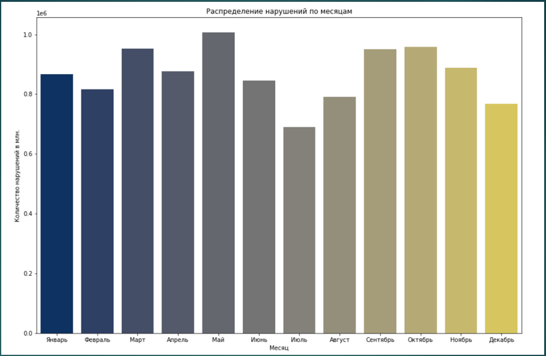
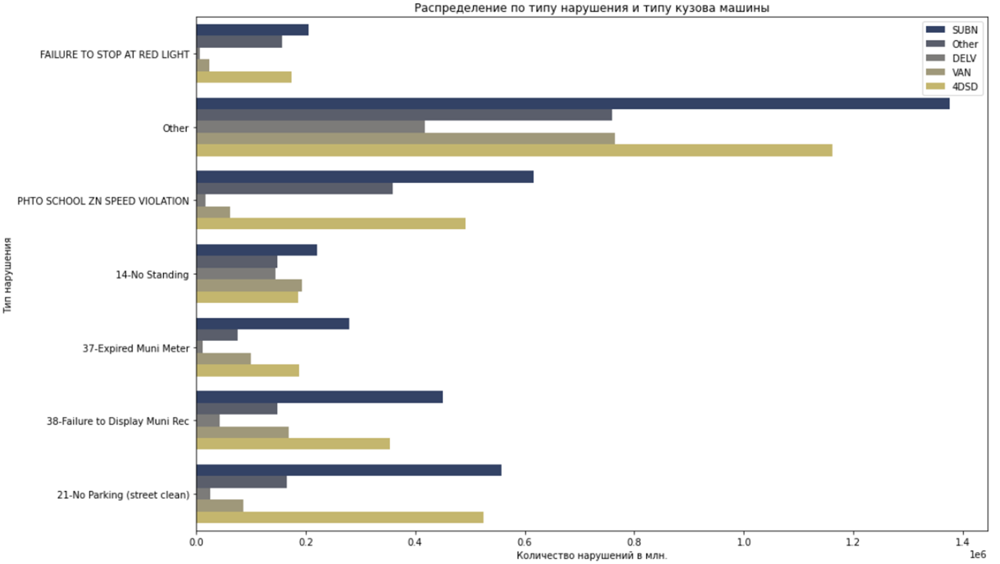
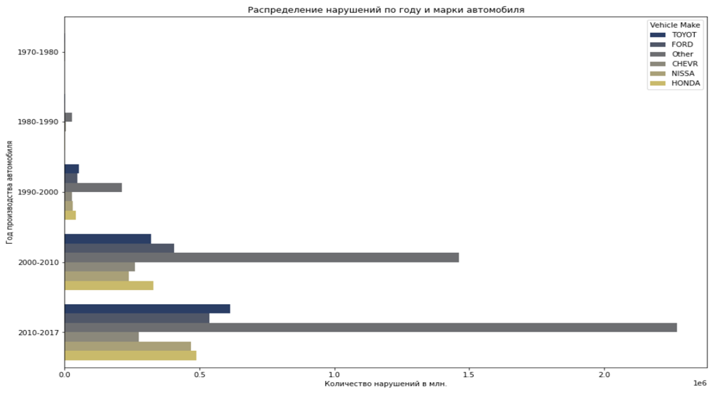
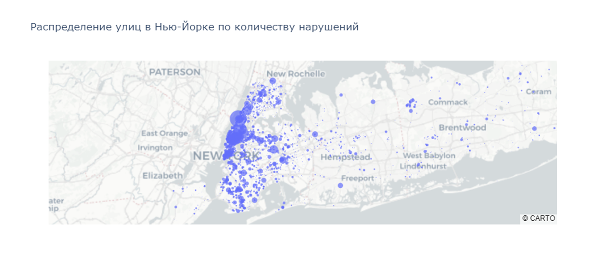
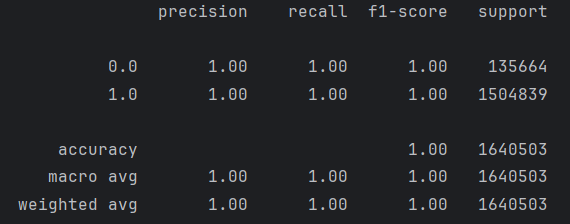

# Проект по анализу штрафов за парковку в городе Нью-Йорк за 2017 год

## Целью анализа данных является ответ на 3 вопроса:
- Когда выписывают больше всего штрафов? Есть сезонность?
- Где чаще всего выдаются штрафы?
- На какие годы и типы автомобилей чаще всего выписываются штрафы?

## Для начала была проведена очистка данных от ненужных столбцов и заполнение пропусков

Данные, которые было невозможно восстановить были удалены. Некоторые колонки в пропусках содержали осмысленную информацию и были заменены на нужную информацию. Колонки, в которых было не слишком много пропусков были заменены модой. В колонках, в которых много категориальных данных и которые близки к друг другу по значению если просто заменить пропуски на самое популярное значение, то этот баланс нарушится и самое популярное значение будет намного чаще встречаться, чем остальные категории, хотя в реальности это не так. Поэтому пропуски в таких колонках были заполнены пропорционально остальным данным

## Анализ:

Можно отметить некую сезонность в нарушениях, смотря на данный график - зимой и летом виден некий спад в количестве нарушений, в отличие от довольно высокого уровня весной и осенью. Зимой можно объяснить спад, возможно, тем что люди меньше ездят на машине из-за погоды и непростых дорожных условиях. Летом, можно предположить, что люди уезжают из города в отпуска и общее количество машин немного уменьшается

Исходя из этого графика можно сделать вывод о том, что все типы автомобилей нарушают различные правила в равной степени пропорционально своему количеству, кроме фургонов, они чаще других, в процентном соотношении, стоят не в разрешенном для этого месте

По данному графику видно, что чаще всего выписывают штрафы на новые автомобили и относительно новые, что говорит о том, что жители Нью-йорка предпочитают ездить на относительно новых автомобилях, что логично. Также стоит отметить то, что в нарушениях присутствует много автомобилей с разными марками. Это говорит нам столбик Other, который многократно превосходит самые популярные автомобили. Это говорит о разнообразности автомобилей, представленном на автомобильном рынке в США. Также столбец Other растет в количественном соотношении намного быстрее по годам, чем самые популярные марки, что говорит о том, что появляется больше различных автомобилей, которые готовы подвинуть лидеров рынка с их места.

## Задача машинного обучения

Задача классификации зарегистрированных автомобилей была выполнена используя градиентный бустинг при помощи библиотеки от яндекса catboost

## Вывод

Анализируя графики зависимости времени обучения модели и других данных я пришел к следующему выводу: Алгоритм градиентного бустинга в процессе своего обучения последовательно создает модели (в данной задачи использовалась модель решающего дерева) так, что каждая следующая модель учится на антиградиенте ошибки предыдущего ансамбля моделей на каждом объекте. Таким образом, получается линейная комбинация моделей по которой и строится прогноз для новых данных.   Зная это можно объяснить линейную зависимость времени от объема данных. Так как необходимо вычислять на каждом шаге (под каждым шагом подразумевается обучения новой модели, также шаг зависит от learningrate, гиперпараметр, который умножается на антиградиент ошибки) антиградиент ошибки предыдущих предсказаний, то с линейным увеличением объектов будет линейно увеличиваться время нахождения этого антиградиента и общее время обучения. Так же можно объяснить экспоненциальное уменьшение времени обучения в зависимости от количества ядер. Количество ядер сильно ускоряют вычисления при распараллеливанию задачи. Так как уже было сказано, что в градиентном бустинге модели строятся последовательно и нельзя построить n+1 модель, пока не готова модель n, то распараллелить мы можем только построение конкретно одной модели (дерева), которая тоже не всегда хорошо раскладывается на параллельные задачи, поэтому здесь мы не видим линейную зависимость